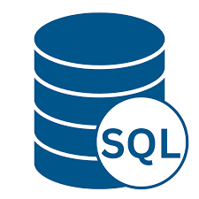
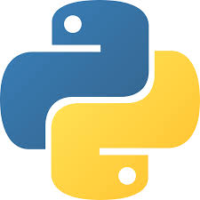
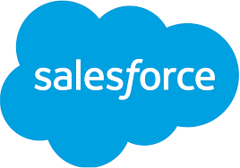
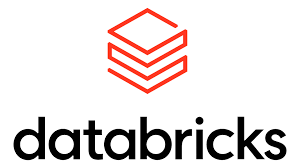

# Hi, I'm Perry 👋

**Business Analyst | Data Analyst | AI Automation Specialist**

I have a background in mechanical engineering and a strong foundation in problem-solving. Skilled in SQL, Excel, Power BI, Tableau, Python, and Salesforce, I enjoy turning raw information into insights that drive better decisions. My passion lies in using data to uncover patterns, solve problems, and create real impact — and increasingly, in automating the analysis pipeline itself so insight gets to decision-makers faster.

📍 Warri, Nigeria — open to remote / visa-sponsored roles
🔗 [LinkedIn](https://www.linkedin.com/in/akpuvie-orughele/) · 📧 [akpuvieorughele@gmail.com](mailto:akpuvieorughele@gmail.com)

---

## Technical & Professional Skills

<p>
&nbsp;&nbsp;
&nbsp;&nbsp;
&nbsp;&nbsp;
&nbsp;&nbsp;
&nbsp;&nbsp;
&nbsp;&nbsp;

</p>

- ⭐ Data Visualization
- ⭐ Report Development
- ⭐ Business Analytics
- ⭐ Statistical Analysis & Experimentation (A/B Testing)
- ⭐ Workflow Automation (n8n, Make.com)
- ⭐ Storytelling with Data

**Stack:** SQL (SQL Server) · Python · Power BI · Tableau · Excel · Salesforce · Databricks · n8n · Make.com · Alteryx

---

## Featured Projects

| # | Project | Business Problem | Tools |
|---|---|---|---|
| 1 | [Retail Profit Erosion Diagnostic](projects/01-retail-profit-erosion-diagnostic) | A single discount policy was silently destroying margin across 9,994 transactions | SQL, Excel |
| 2 | [A/B Test: Rewarded Ad Placement](projects/02-ab-test-rewarded-ad-placement) | Does a new ad placement grow revenue without hurting retention? Full 14-step experimentation framework, executed notebook, statistically rigorous decision. | Python, scipy, statsmodels, Jupyter |
| 3 | [E-Commerce KPI & Margin Reporting System](projects/03-ecommerce-kpi-margin-sql) | Giving leadership a single, validated source of truth for sales performance | SQL |
| 4 | [Customer Churn Risk & Pricing Gap Analysis](projects/04-customer-churn-pricing-sql-tableau) | 28% of customers generating 44% of revenue were showing leading churn indicators | SQL, Tableau |
| 5 | [Superstore Sales & Regional Performance Analysis](projects/05-superstore-sales-excel) | Self-service reporting revealing the gap between revenue rank and profit contribution | Excel |
| 6 | [Retail E-Commerce Profitability & Risk Assessment](projects/06-retail-ecommerce-risk-assessment-sql) | Identifying payment, margin, and customer value risks in a high-revenue operation | SQL Server |
| 7 | [Supply Chain Delay & Cost Leakage Assessment](projects/07-supply-chain-delay-cost-leakage) | Translating 200K+ shipment records into a carrier reallocation recommendation | SQL, Power BI |

---

### 🎯 Project Spotlight: A/B Testing & Experimentation

**[Rewarded Ad Placement A/B Test](projects/02-ab-test-rewarded-ad-placement)** — a mobile gaming/adtech experiment testing whether a new ad placement increases revenue without hurting retention. Covers the full experimentation lifecycle: hypothesis and metric definitions, sample size and power calculations, randomization checks, statistical testing (t-test, Mann-Whitney, two-proportion z-test), and segmentation analysis with multiple-comparison correction. The result was a guardrail violation — retention dropped even as ad revenue rose — so the write-up documents a "do not ship" recommendation with a concrete iteration path, not just a clean win.

---

## Repository Structure

```
business-analyst-portfolio/
├── README.md
├── assets/
│   └── icons/
└── projects/
    ├── 01-retail-profit-erosion-diagnostic/
    ├── 02-ab-test-rewarded-ad-placement/
    ├── 03-ecommerce-kpi-margin-sql/
    ├── 04-customer-churn-pricing-sql-tableau/
    ├── 05-superstore-sales-excel/
    ├── 06-retail-ecommerce-risk-assessment-sql/
    └── 07-supply-chain-delay-cost-leakage/
```

---

## Get in Touch

I'm actively exploring **Analytics Engineer** and **Data Engineer** roles, with a focus on positions offering visa sponsorship or remote work. If any of these projects resonate with a problem your team is facing, let's talk.

🔗 [LinkedIn](https://www.linkedin.com/in/akpuvie-orughele/) · 📧 [akpuvieorughele@gmail.com](mailto:akpuvieorughele@gmail.com)
